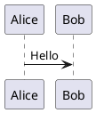

# Confluence to Markdown Exporter

A Python CLI tool that downloads a Confluence Cloud page by content ID and converts its storage format (XHTML with custom `ac:` namespace macros) into Sphinx/MyST-compatible Markdown.

## Features

- Fetches pages via Confluence Cloud REST API (v1 and v2)
- Converts headings, paragraphs, lists, links, bold/italic, inline code
- Handles Confluence macros: `code`, `plantuml`, `drawio`, `ui-tabs`, `ui-tab`, `ui-expand`
- Unknown macros produce readable placeholders (no content is lost)
- Table algorithm with merged cell markers (`rowspan=N,colspan=N`)
- Automatic hoisting of complex table cells (nested tables, code blocks, lists)
- Deterministic output — same input always produces the same Markdown
- Exponential backoff retry on 429 and 5xx errors
- YAML config file support

## Requirements

- Python >= 3.12

## Installation

```bash
# Clone the repository
git clone <repo-url>
cd confluence-to-markdown-exporter

# Create a virtual environment and install
python3 -m venv .venv
source .venv/bin/activate
pip install -e .

# For development (includes pytest)
pip install -e ".[dev]"
```

## Usage

### Basic usage

```bash
# Set your Confluence API token
export CONFLUENCE_TOKEN="your-api-token-here"

# Export a page
confluence_export \
  --base-url https://your-tenant.atlassian.net/wiki \
  --page-id 123456789 \
  --out output/page.md
```

### All CLI options

```
confluence_export \
  --base-url URL       Confluence Cloud base URL (include /wiki if needed)
  --page-id ID         Page content ID
  --out PATH           Output markdown file path
  --token-env VAR      Env var name for the API token (default: CONFLUENCE_TOKEN)
  --api-mode {v1,v2}   API mode (default: v2)
  --config FILE        Optional YAML config file
```

### Using a config file

Create a `config.yaml`:

```yaml
base_url: https://your-tenant.atlassian.net/wiki
api_mode: v2
token_env: CONFLUENCE_TOKEN
```

Then run with fewer flags:

```bash
confluence_export --config config.yaml --page-id 123456789 --out output/page.md
```

CLI arguments override values from the config file.

### Using the v1 API

Some Confluence instances only support the v1 REST API:

```bash
confluence_export \
  --base-url https://confluence.example.com \
  --page-id 123456789 \
  --api-mode v1 \
  --out output/page.md
```

### Using a custom token environment variable

```bash
export MY_TOKEN="your-api-token"

confluence_export \
  --base-url https://your-tenant.atlassian.net/wiki \
  --page-id 123456789 \
  --token-env MY_TOKEN \
  --out output/page.md
```

### Using the converter as a library

You can convert Confluence storage-format HTML directly without fetching:

```python
from confluence_export.converter import convert_html

html = open("page_storage.html").read()
markdown = convert_html(html)
print(markdown)
```

## Output Examples

### Headings

```html
<h1>Title</h1>
<h2>Subtitle</h2>
```

```markdown
# Title

## Subtitle
```

### Code blocks (Confluence code macro)

```html
<ac:structured-macro ac:name="code">
  <ac:parameter ac:name="language">python</ac:parameter>
  <ac:plain-text-body><![CDATA[print("hello")]]></ac:plain-text-body>
</ac:structured-macro>
```

````markdown
```python
print("hello")
```
````

### PlantUML diagrams

```html
<ac:structured-macro ac:name="plantuml">
  <ac:plain-text-body><![CDATA[@startuml
Alice -> Bob : Hello
@enduml]]></ac:plain-text-body>
</ac:structured-macro>
```

````markdown

````

### Tables with merged cells

```html
<table>
  <tr><th>A</th><th>B</th></tr>
  <tr><td colspan="2">merged</td></tr>
</table>
```

```markdown
| A                  | B   |
| ------------------ | --- |
| merged colspan=2 |     |
```

### Complex cell hoisting

When a table cell contains a code block, nested table, list, or multiple paragraphs, the content is automatically hoisted out of the table:

```markdown
| Column 1 | Column 2                                   |
| -------- | ------------------------------------------ |
| simple   | See: [T1-R2C2-block-1](#t1-r2c2-block-1)   |

### T1-R2C2-block-1

​```json
{"key": "value"}
​```
```

The hoisted section heading generates a MyST anchor (`#t1-r2c2-block-1`) that the table cell links to. Set `myst_heading_anchors = 3` (or higher) in your Sphinx `conf.py`.

### Draw.io diagrams

Draw.io macros produce a comment placeholder:

```markdown
<!-- drawio: diagram name -->
```

### Unknown macros

Unknown macros are preserved as comments with their parameters, followed by any inner content:

```markdown
<!-- unknown macro: custom-macro, params: key1=val1, key2=val2 -->

Inner content is rendered normally here.
```

## Running Tests

```bash
source .venv/bin/activate
pytest tests/ -v
```

Tests include:
- Golden file test (full storage HTML → Markdown comparison)
- Individual element conversion tests (headings, bold, italic, links, lists, code, macros)
- Table algorithm tests (grid building, merged cells, hoisting, numbering column stripping)

## Project Structure

```
pyproject.toml                          # Package config and dependencies
src/confluence_export/
    __init__.py
    cli.py                              # argparse CLI entry point
    config.py                           # YAML config loading
    main.py                             # Orchestrator (fetch → convert → write)
    fetch.py                            # Confluence REST API client with retries
    converter.py                        # Recursive HTML → Markdown converter
    tables.py                           # Table grid building and hoisting algorithm
    models.py                           # Data classes (TableGrid, CellInfo, HoistedBlock)
tests/
    test_converter.py                   # Converter unit tests
    test_tables.py                      # Table algorithm tests
    fixtures/
        sample_storage.html             # Confluence storage format input
        sample_expected.md              # Golden Markdown output
examples/
    body-storage/                       # Exported HTML page (full fixture)
    PDF/                                # PDF rendering for visual reference
    exporter-script/                    # Reference Python script and its outputs
SPEC.md                                # Full specification
```

## License

See repository for license details.
