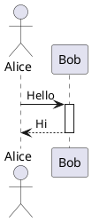

# Заголовок первого уровня

## Заголовок второго уровня

### Заголовок третьего уровня

#### Заголовок четвертого уровня

**Обычная таблица**

| Колонка 1         | Колонка 2         |
| ----------------- | ----------------- |
| значение в ячейке | значение в ячейке |
| значение в ячейке | значение в ячейке |

**Сложная таблица**

| Колонка 1                       | Колонка 2                                |
| ------------------------------- | ---------------------------------------- |
| значение в ячейке               | значение в ячейке                        |
| значение в ячейке               | значение в ячейке                        |
| объединение колонок colspan=2 |                                          |
| объединение строк rowspan=2   | See: [T2-R5C2-block-1](#t2-r5c2-block-1) |
|                                 | See: [T2-R6C2-block-1](#t2-r6c2-block-1) |

### T2-R5C2-block-1

Вложенная таблица

|     |     |
| --- | --- |
|     |     |
|     |     |

### T2-R6C2-block-1

Пример кода

```json
{
  "id": "425576",
  "cex": "string"
}
```

## Блок кода

```json
{
  "id": "425576",
  "cex": "string"
}
```

## Диаграмма plantuml



## Диаграмма drawio

<!-- drawio: demo drawio diagram -->

## Вкладки

**tab number 1**

**Сложная таблица**

| Колонка 1                       | Колонка 2                                |
| ------------------------------- | ---------------------------------------- |
| значение в ячейке               | значение в ячейке                        |
| значение в ячейке               | значение в ячейке                        |
| объединение колонок colspan=2 |                                          |
| объединение строк rowspan=2   | See: [T4-R5C2-block-1](#t4-r5c2-block-1) |
|                                 | See: [T4-R6C2-block-1](#t4-r6c2-block-1) |

### T4-R5C2-block-1

Вложенная таблица

| ID                | Value                                    |
| ----------------- | ---------------------------------------- |
| значение в ячейке | значение в ячейке                        |
| значение в ячейке | See: [T5-R3C2-block-1](#t5-r3c2-block-1) |

### T5-R3C2-block-1

Вторая вложенная таблица

| Колонка 1         | Колонка 2         |
| ----------------- | ----------------- |
| значение в ячейке | значение в ячейке |
| значение в ячейке | значение в ячейке |

### T4-R6C2-block-1

Пример кода

```json
{
  "id": "425576",
  "cex": "string"
}
```

**tab number 2**

**Раскрывающийся блок**

**Обычная таблица**

| Колонка 1         | Колонка 2         |
| ----------------- | ----------------- |
| значение в ячейке | значение в ячейке |
| значение в ячейке | значение в ячейке |
